## Cubic Font Spline

This site explains what *Cubic Font Spline* algorithm is all about and it's possible applications in real world.

## What is Cubic Font Spline?

*Cubic Font Spline* is an algorithm designed to generate cubic spline curves from TrueType font data. It is to be used in game industry to serve as a spline making tool in PCG (prodedural content generation) and other VFX that utilize cubic splines. The following is a glimpse of the principle mathematical methods that underly the alorithm.

### TrueType from a mathematical point of view

*TrueType* technology is powered by the quadratic *Bézier* curve defined by a parameterized function shown bellow.

$$B(t)=P_1+(1-t)^2(P_0-P_1)+t^2(P_2-P_1), \hspace{0.3cm} 0 \le t \le 1$$

Where $P_0$, $P_1$, and $P_2$ are the control points at different locations in space.

### Cubic Hermite Spline

In computer graphics related industries, cubic *Hermite* spline is widely used. It's defined by the following parametric function.

$$P(t)=(2P_0+m_0-2P_1+m_1)t^3+(-3P_0+3P_1-2m_0-m_1)t^2+m_0t+P_0, \hspace{0.3cm} 0 \le t \le 1$$

Where $P_0$ and $P_1$ are the control points of the curve, $m_0$ and $m_1$ are the tangents at $P_0$ and $P_1$ respectively.

*Bézier curve* and *Hermite spline* are different in nature. They have different pratical applications in real world, and cannot be used interchangeablely. [This link](https://graphics.stanford.edu/courses/cs148-09/lectures/splines.pdf) might be a good place to start with in case you want to know more about this topic.

## How Does Cubic Font Spline Work?

*Cubic Font Spline* comes with two seperate modules. One of them is the algorithm itself implemented as a dynamic link library, which is ready to be integrated into other systems. The other is a dedicated editor which is designed and implemented as an Unreal Engine plugin. Fig. 1 shows what the editor looks like.

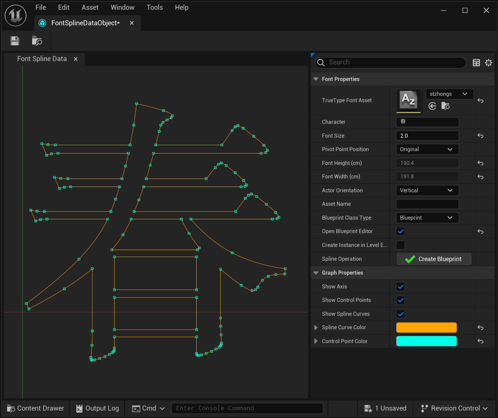  
Fig.1 Cubic Font Editor User Interface  

The rendered curves are the Chinese character for "spring". Control points are also shown to give a rough idea of how the spline is constructed. Why "curves" rather than "curve"? The character "春" comprises multiple separated parts, and each of them is rendered as a single spline. In most cases multiple splines have to be generated to render a single character. The coordinate system is also shown to give a hint of how the character was made by the font manufacturer.

Fig. 2 shows how well the algorithm performs in terms of accuracy by layering the outline of "春" generated by the algorithm on top of the character rendered by Windows. The image was prepared with *Gimp* and *Microsoft PowerPoint*. No visual discrepancy can be observed from the result.

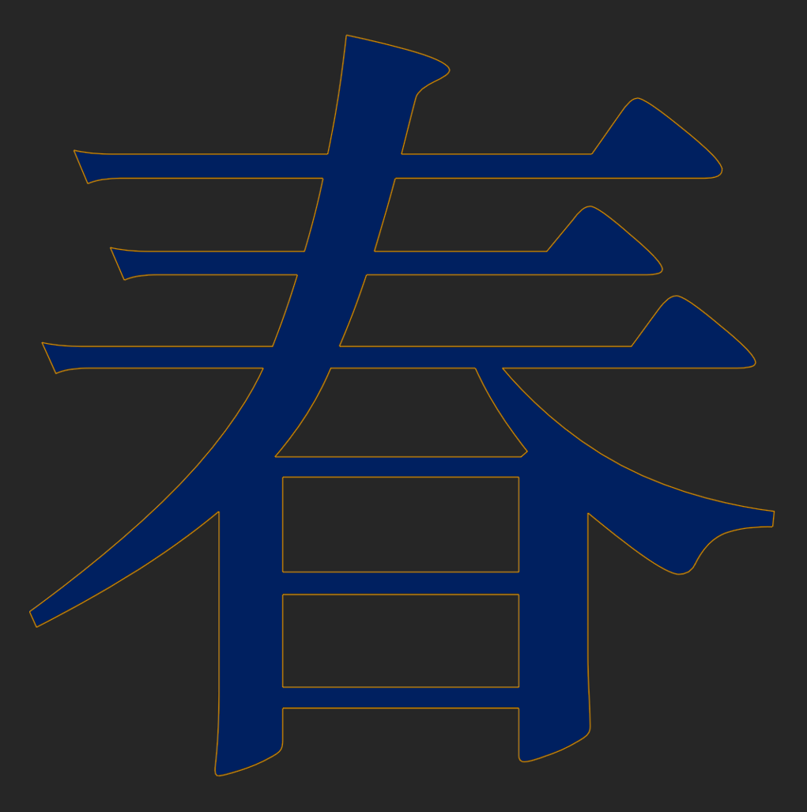  
Fig.2 Bézier Curve (in blue color) And Hermite Spline (in orange color) Comparison  

The original control points of *Bézier* spline and the rendering result is provided below for comparison reason. The image was prepared with *Microsoft Excel*.

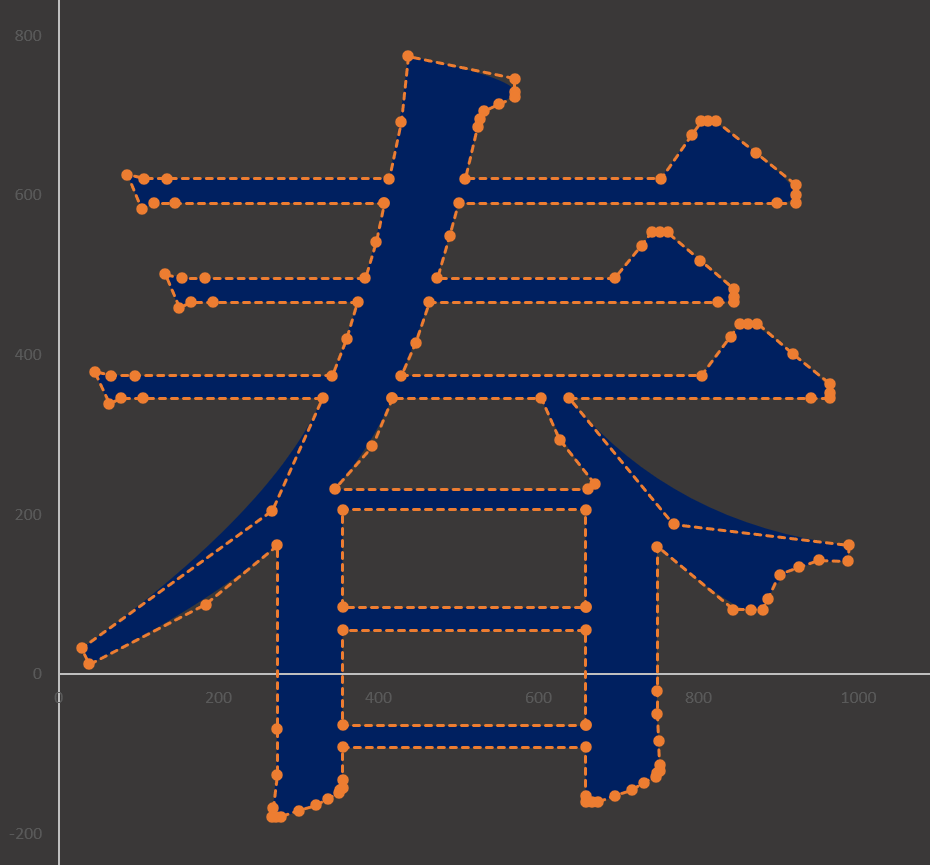  
Fig.3 Control Points of Bézier Curve  

## Performance Analysis

A program was developed to evaluate the performance of the algorithm by collecting several key data at runtime. Table 1 lists the values recorded during the test run. Meaning of each column is as follows.

1. Font name.
2. Number of characters evaluated in each font file.
3. Maximum number of control points (Max CPs) in characters from one font file.
4. Minimum number of control points (Min CPs) in characters from one font file.
5. Average number of control points (Avg CPs) of one character.
6. Total elapsed time for generating control points for all the characters in one font file.
7. Average elapsed time (Avg Time) for generating control points for one character.

| Font Name | Example | Number of Characters | Max CPs | Min CPs | Avg CPs | Total Time (ms) | Avg Time (ms) |
| --- | --- | --- | --- | --- | --- | --- | --- |
| Arial | 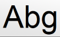 | 94 | 118 | 4 | 27.7 | 4.6 | 0.049 |
| Times New Roman | 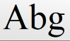 | 94 | 114 | 4 | 43.8 | 5.99 | 0.063 |
| STZhongsong|  | 20902 | 732 | 16 | 209.81 | 2620.33 | 0.125 |
| SimSun |  | 27648 | 427 | 7 | 126.40 | 2343.98 | 0.084 |
| JhengHei | 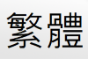 | 50734 | 316 | 4 | 51.11 | 2329.59 | 0.045 |
| Dubai | 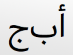 | 940 | 346 | 4 | 15.69 | 27.70 | 0.029 |
| MSGothic | 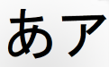 | 447 | 99 | 4 | 19.87 | 37.18 | 0.083 |
| Malgun Gothic | 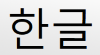 | 11172 | 123 | 10 | 57.57 | 856.47 | 0.076 |
| Himalaya | 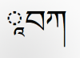 | 219 | 394 | 4 | 92.90 | 12.14 | 0.055 |
| TaiLe | 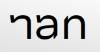 | 2357 | 123 | 4 | 8.99 | 38.35 | 0.016 |
| Monogolian Baiti | 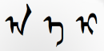 | 155 | 399 | 9 | 91.82 | 8.51 | 0.054 |
| Myanmar Text | 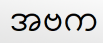 | 43 | 375 | 62 | 124.35 | 3.00 | 0.069 |

Total of 10 different languages were used in the evaluation. Performance varies from character to character affected by the number of control points a character has. Fig. 4 shows the relevance of average number of control points and the generation time to the font.

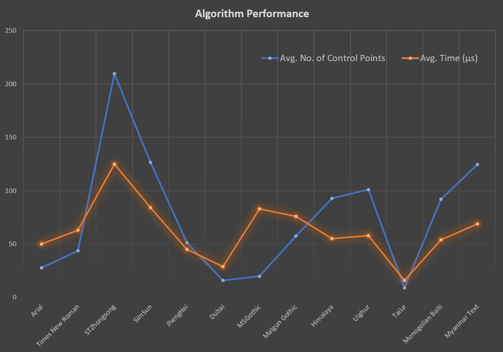  
Fig.4 Performance Test Result  

Tests were carried out on an old platform with an Intel Core i7-10875H CPU running at 2.30GHz. Code was compiled against *Microsoft C++* compiler version 19.39.33523.

## Possible Applications

Many fatures are provided by the editor shown in Fig. 1 to help developers and artists to carry out the following tasks.

#### 1. Generation of Blueprint Actor Template

If font name and other required parameters are set in the editor's DetailsView panel on the right hand side, the "Create Blueprint" button is enabled and a click on it will lead to the generation of a blueprint template. Fig. 5 shows the UE blueprint editor with the template opened. As can be seen in the image, the template is configured with 4 USplineComponent instances and each of them is initialized with control points generated by the algorithm. Every USplineComponent instance can be manually edited and saved for later use. This means, the character shaped splines can be deformed to make it seem different from the original appearance.

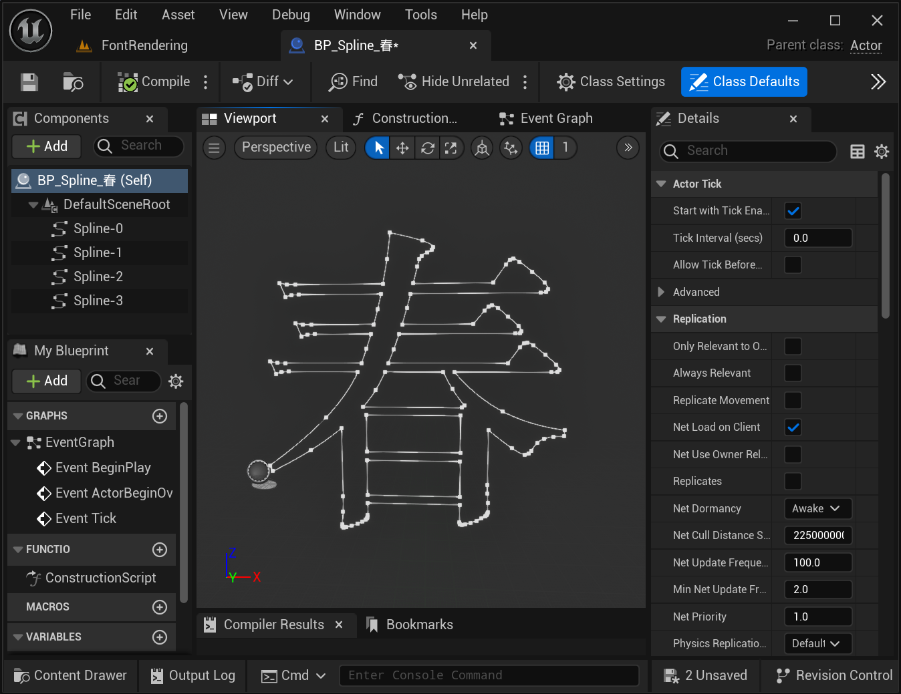  
Fig. 5 Blueprint Template  

#### 2. Spline Meshes

USplineMeshComponent is added to each USplineComponent automatically to make static mesh follow character shaped splines if the properties are set acordingly. If run-time performance is a critical factor to consider, the instance of the generated spline mesh instance in scene can be easily converted to UStaticMesh asset by using a feature of the editor shown in Fig. 6.

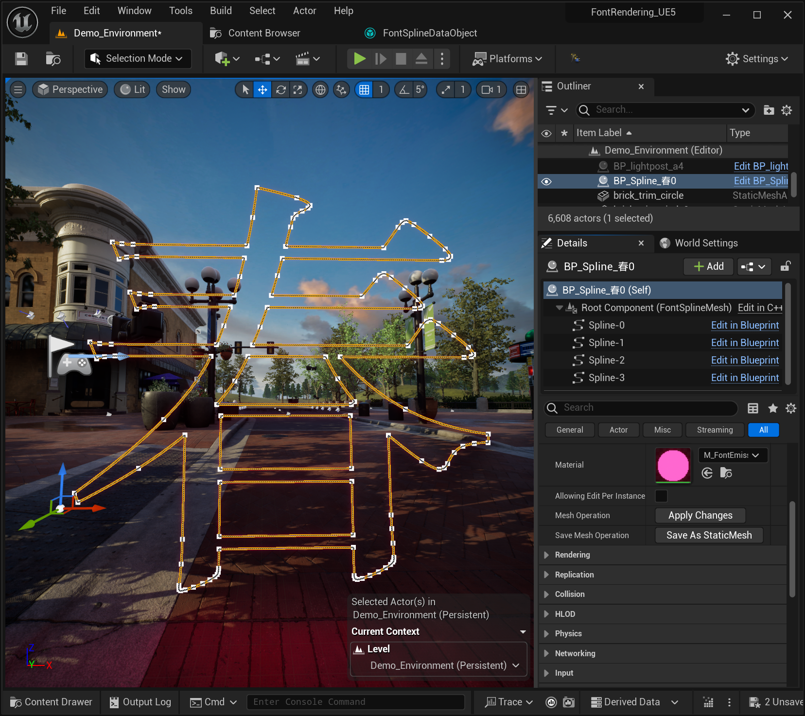  
Fig. 6 Save As StaticMesh Feature  

Positions and tangents of the control points can be edited manually. Static mesh and material can also be changed. Fig. 7 shows the blueprint editor with generated spline mesh for character "春" loaded.

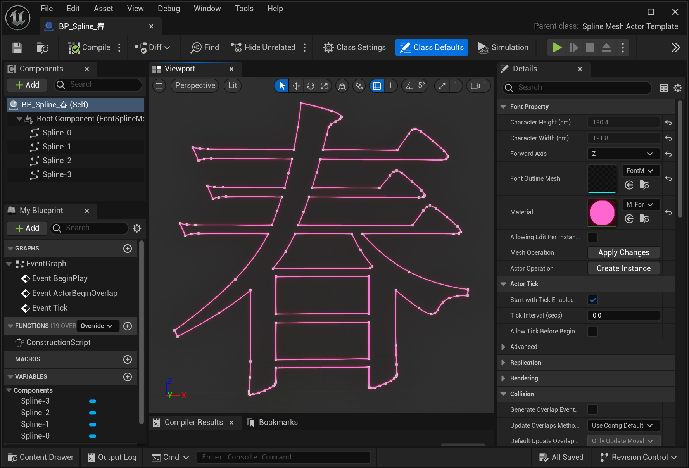  
Fig. 7 Blueprint Template of Spline Mesh  

Fig. 8 shows a possible application of this feature. Neon lights in the scene are actually static meshes with emission material.

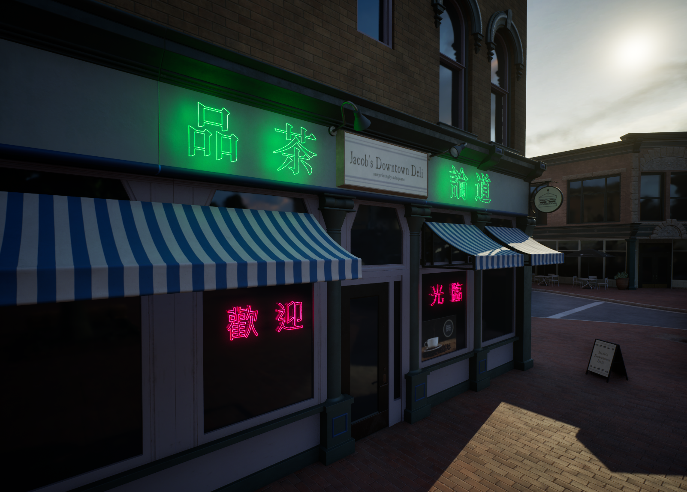  
Fig. 8 Neon Lights Created from Splines, Static Mesh, and Emissive Material  

### VFX

Font spline can be used with Niagara System as particle paths. Fig. 9 shows how particles are generated along spline curves in Niagara and controlled by Blueprint.

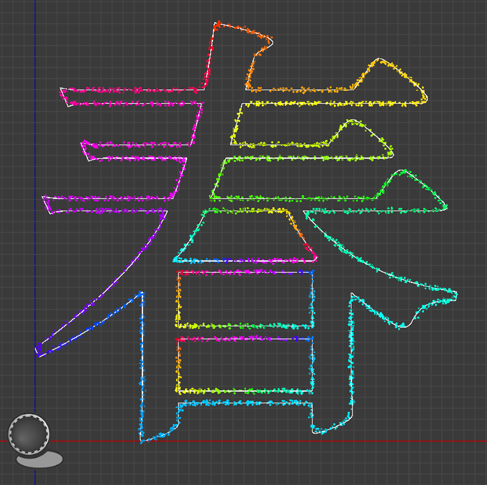  
Fig. 9 Particles Moving Along Paths  

### PCG

TrueType font splines can also be used as PCG guide lines to generate landscape or decorated areas illustrated below.

  
  
Fig. 10 PCG with TrueType Font Splines.  
